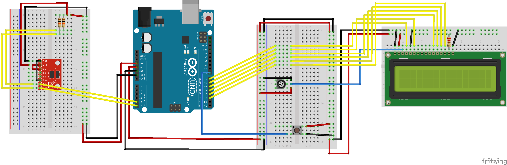

# Smart Classroom
This is a project to hook up an Arduino borad to Twitter using Python. It takes data information from an Aruino in the classroom and tweet to the Twitter account [@SheridanS421](https://twitter.com/SheridanS421 "Sheridan S421").

The project is based on [pySerial](https://github.com/pyserial/pyserial), [Python Arduino Prototyping API v2](https://github.com/vascop/Python-Arduino-Proto-API-v2) and [Tweepy](https://github.com/tweepy/tweepy).

## Basic Setup
1. Go to [Twitter Apps](https://apps.twitter.com/) to create an app and generate your API tokens if you haven't already
2. Hook up the Arduino board with the sensors and output devices. [This](./sketch/) is a example hooking up with a button, a 16 * 2 LCD and a [ADXL345 accelerometer](http://playground.arduino.cc/Main/InterfacingWithHardware#motion_accelerometer):
	
3. Clone this repository or [Download ZIP](https://github.com/neolwc/SmartClassroom/archive/master.zip)
4. Paste your Twitter API tokens to `tweet.py`
5. Use the Arduino IDE to open the `ArduinoAPI.ino` under the directory [ArduinoAPI](./ArduinoAPI/)
6. Start from a new `.py` file under the same directory, and [here](./template.py) is a basic template:
```python
from arduino import *
from tweet import *
arduino = Arduino('COM6') // Use the Arduino port
arduino.output([])
```

## Basic Example
[Here](./example.py) is a basic example that tweets when someone presses the button:
```python
from tweet import *
from arduino import *

arduino = Arduino('COM6')
arduino.output([])

buttonPin = 8

print "INITIATE"
today = 0
total = 0

while True:
	button = arduino.getState(buttonPin)
	time.sleep(0.1)
	if button:
		today += 1
		total += 1
		tmp = arduino.getTemp()
		arduino.LCD(today, total, int(round(tmp)))
		name = str(raw_input("Who pressed me?! "))
		print tweet(name + " pressed the big red button!")
		time.sleep(1)
```
It gets the name from user input in the Python console when somebody presses the button and send a tweet with the name.
